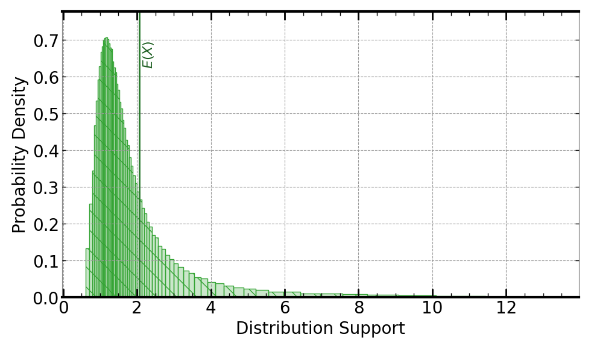

[](https://signaloid.io/repositories?connect=https://github.com/signaloid/Signaloid-Demo-Finance-MoonfireVentureCapitalPortfolioModeling#gh-dark-mode-only)
[](https://signaloid.io/repositories?connect=https://github.com/signaloid/Signaloid-Demo-Finance-MoonfireVentureCapitalPortfolioModeling#gh-light-mode-only)

# Moonfire Portfolio Modelling
This example implements a portfolio analysis model based on the paper [Venture Capital Portfolio Construction](https://arxiv.org/pdf/2303.11013.pdf)
which adopts Monte Carlo simulations  and forms the basis for the [Moonfire Portfolio Simulator](https://www.moonfire.com/playgrounds/portfolio-simulator/).
The model assumes that the portfolio investment returns follow a Pareto distribution (a.k.a. power-law distribution) of the form $Cx^{-\alpha}$ supported on
[xMin, xMax]. It illustrates the utility of the Signaloid Compute Platform in simplifying a probabilistic analysis for an investment portfolio.

## Getting started
The correct way to clone this repository to get the submodules is:
```sh
	git clone --recursive git@github.com:signaloid/Signaloid-Demo-Finance-MoonfireVentureCapitalPortfolioModeling.git
```

If you forgot to clone with `--recursive` and end up with empty submodule directories, you can remedy this with:
```sh
	git submodule update --init
```

## Running the application on the Signaloid Cloud Developer Platform
To run this application on the [Signaloid Cloud Developer Platform](https://signaloid.io),
you need a Signaloid account. You can sign up for a Signaloid account using [this link](https://get.signaloid.io).

Once you have a Signaloid account, you can click the "add to signaloid.io" button at the
top of this `README.md` to connect this repository to the Signaloid Cloud Developer Platform
and run the application.

## Running the application locally
Apart from using Signaloid's Cloud Compute Platform, you can compile and run this application
locally. Local execution is essentially a native Monte Carlo implementation,
that uses GNU Scientific Library[^GSL] to generate samples for the different input distributions.
In this mode the application stores the generated output samples, in a file called `data.out`.
The first line of `data.out` contains the execution time of the Monte Carlo implementation
in microseconds (μs), and each next line contains a floating-point value corresponding to an output sample value.

In order to compile and run this application in the native Monte Carlo mode:

0. Install dependencies (e.g., on Linux):
```
sudo apt-get install libgsl-dev libgslcblas0
```
1. Compile natively (e.g., on Linux):
```
cd src/
gcc -I. -I/opt/local/include main.c utilities.c common.c uxhw.c -L/opt/local/lib -o native-exe -lgsl -lgslcblas -lm
```
2. Run the application in the MonteCarlo mode, using (`-M`) command-line option:
```
./native-exe -M 10000
```
The above program runs 10000 Monte Carlo iterations.
3. See the output samples generated by the local Monte Carlo execution:
```
cat data.out
```

## Usage
```
Example: Moonfire Venture Capital Portfolio Modeling - Signaloid version

Usage: Valid command-line arguments are:
        [-o, --output <Path to output CSV file : str>] (Specify the output file.)
        [-S, --select-output <output : int> (Default: 0)] (Compute 0-indexed output.)
        [-M, --multiple-executions <Number of executions : int> (Default: 1)] (Repeated execute kernel for benchmarking.)
        [-T, --time] (Timing mode: Times and prints the timing of the kernel execution.)
        [-b, --benchmarking] (Benchmarking mode: Generate outputs in format for benchmarking.)
        [-j, --json] (Print output in JSON format.)
        [-h, --help] (Display this help message.)
        [-a, --alpha-pareto <Portfolio return bounded Pareto distribution parameter 'alpha': double in (0, inf)> (Default: 1.05)]
        [-x, --xMin-pareto <Portfolio return bounded Pareto distribution parameter 'xMin': double in (0, xMax]> (Default: 0.35)]
        [-X, --xMax-pareto <Portfolio return bounded Pareto distribution parameter 'xMax': double in [xMin, inf)> (Default: 1000.00)]
        [-n, --number-of-investments <Number of investments in portfolio: size_t in [1, inf)> (Default: 100)]
        [-q, --low-quantile-probability <Low quantile probability: double in (0, 1)> (Default: 0.01)]
        [-Q, --high-quantile-probability <High quantile probability: double in (0, 1)]> (Default: 0.99)]
```

## Inputs
The inputs to the example portfoilio analysis tool are the number of investments in the portfoilio,
the parameters `alpha`, `xMin`, and `xMax` of the bounded Pareto distribution that each investment
retrun is assumed to follow, and the low and high quantile probability values of interest for the
total portfoilio return. Each investment return is assumed to be distributed as
`BoundedPareto(alpha, xMin, xMax + xMin) - xMin`.

## Outputs
The main output of the example is the distribution for the portfolio return. Based on this distribution,
the example also prints out the probability of loss for the portfolio, as well as the quantiles for the
provided low and high quantile probability values.

Following is an example output, using Signaloid's C0Pro-L core, for the default inputs:




<br/>
<br/>
<br/>

[^GSL]: [GNU Scientific Library](https://www.gnu.org/software/gsl/).
